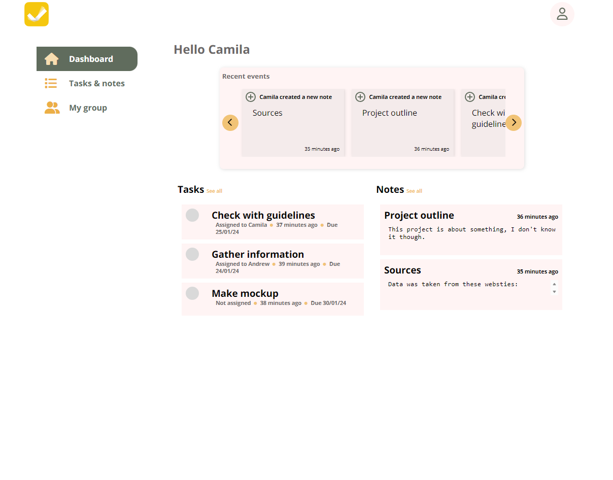
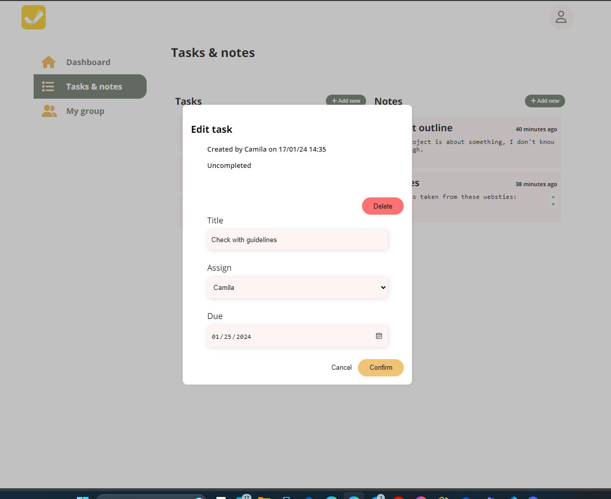
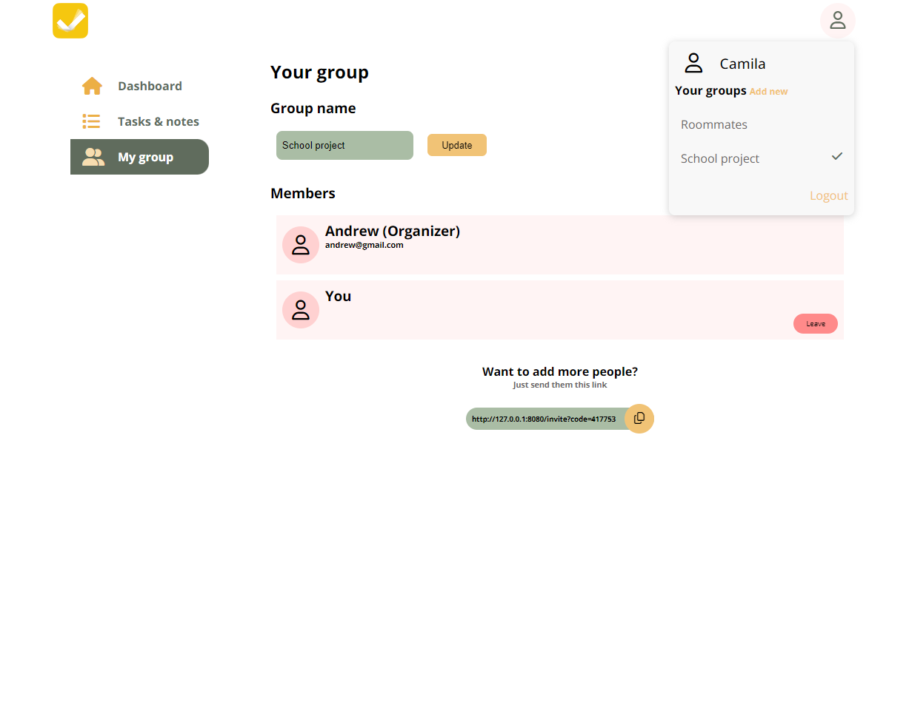
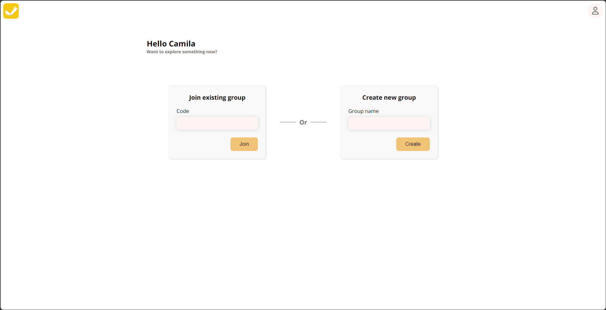
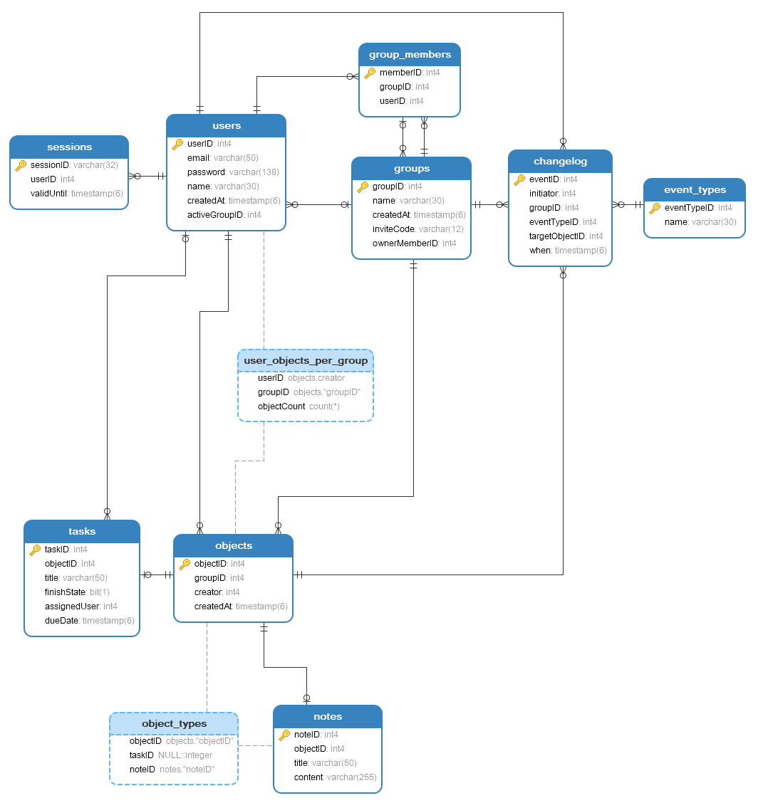

# Taskmate

Web application made for the class "Wstęp do programowania aplikacji internetowych" on the Cracow University of Technology.

Application is a basic task and notes management system with support of multiple groups. Once registered, user can create up to 3 groups and join unlimited amount of groups.
In each group user can create, edit, remove, complete and uncomplete tasks as well as notes. Tasks can additionally be assigned to specific group member and be assigned with due date. Each member can leave group at any time, but can also be kicked from it by the organizer, which is the person that created the group. Organizer can also leave their own group, in that case role of the organizer is passed to other group member. If organizer was the last to leave, group is being removed along with all data associated with it. A lot of actions taken by users inside a group can be tracked by changelog visible on the home page.

## Table of contents
- Presentation
- Requirements
- Installation
- Dummy data
- Maintainers

## Presentation
#### Dashboard

#### Task Details

#### Group management

#### Joining or creating a new group

#### ERD of the database

## Requirements

This app requires following frameworks and modules:
- [Docker container](https://www.docker.com)

## Installation
Deploy and run application inside the docker container using this command:
 `docker compose up`
Then you can access the system by visiting [127.0.0.1:8080](http://127.0.0.1:8080).

## Dummy data
Along with source code, there is also sql code attached with table structure and examplatory data. Within this data there are 3 users defined:

- Andrew
andrew@gmail.com password: Andrew_passwd
- Camila
camila@gmail.com password: Camila_passwd
- Dave
dave@gmail.com password: Dave_passwd

You can use them to try all of this app's features.

## Maintainers

- Damian Omiotek - [github](https://www.github.com/domiotek)
